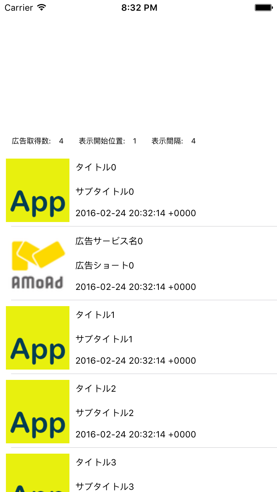
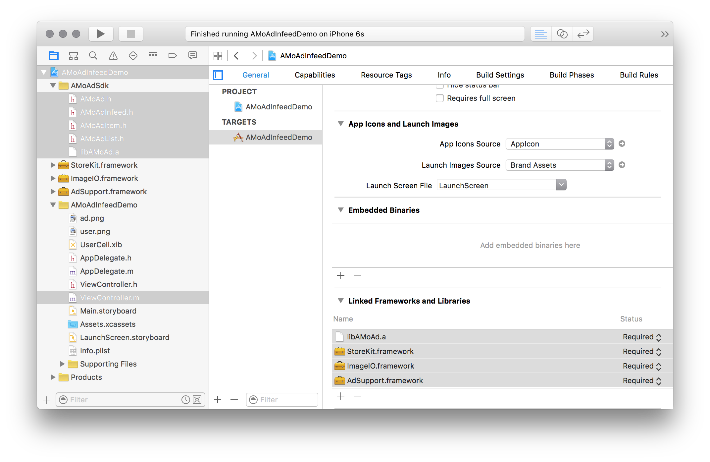

<div align="center">

</div>

# AMoAd Infeed Demo for iOS




## Introduction

アプリのViewに広告画像とテキストを表示することができるインフィード広告です。
表示開始位置と間隔を管理画面から設定することができます。

## Requirements

iOS 6.0 or later

## Installing

[ZIPをダウンロード](https://github.com/amoad/amoad-nativelist-ios-sdk/archive/master.zip)

## Usage

管理画面から取得したsidをViewController.mのkSidに設定する。

```objc
// [SDK] 管理画面から取得したsidを入力してください
static NSString *const kSid = @"62056d310111552c000000000000000000000000000000000000000000000000";
```

## API

[AMoAd Infeed API](AMoAdInfeedDemo/AMoAdInfeedDemo/AMoAdSdk/AMoAdInfeed.h)

[AMoAd List API](AMoAdInfeedDemo/AMoAdInfeedDemo/AMoAdSdk/AMoAdList.h)

[AMoAd Item API](AMoAdInfeedDemo/AMoAdInfeedDemo/AMoAdSdk/AMoAdItem.h)

## Project Settings

### 設定例

[ATS (App Transport Security) を抑制する](https://github.com/amoad/amoad-ios-sdk/blob/master/Documents/Install/Install.asciidoc#ats-app-transport-security-を抑制する)


